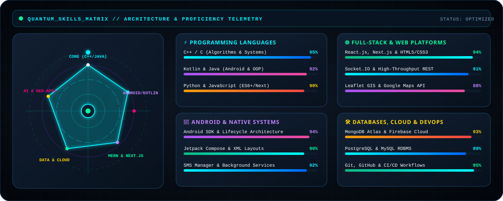
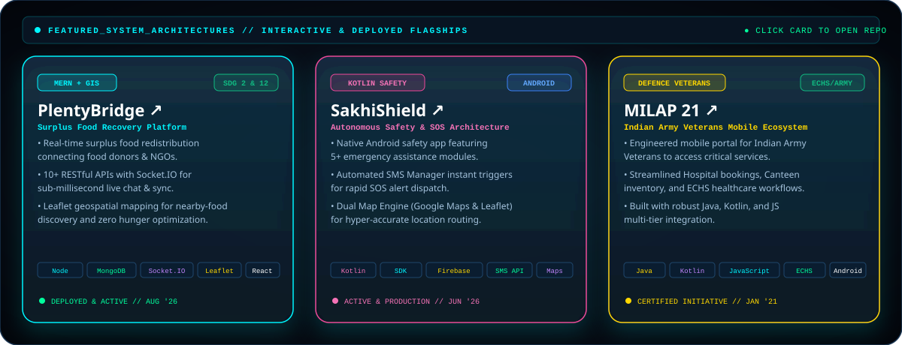

<div align="center">

<!-- ==================== 1. HERO SVG BANNER ==================== -->
<a href="https://github.com/tejashr94">
  
</a>

<br/><br/>

<!-- DYNAMIC TYPING SVG HEADER -->
<a href="https://github.com/tejashr94">
  
</a>

<br/>

<!-- CONTACT & SYSTEM BADGES -->
<p align="center">
  <a href="https://www.linkedin.com/in/tejashrai"></a>
  <a href="https://github.com/tejashr94"></a>
  <a href="mailto:tejashr94@gmail.com"></a>
  <a href="tel:+919501039134"></a>
  
</p>

</div>

---

<div align="center">

<!-- ==================== 2. LPU CYBER ID CARD SVG ==================== -->
## 🪪 LOVELY PROFESSIONAL UNIVERSITY // SMART CYBER ID
*Animated Holographic ID Card featuring Real Embedded Portrait, Dynamic Laser Scanner, EMV Smart Chip, and 100% Camera-Scannable QR Code.*

<br/>

<a href="https://github.com/tejashr94">
  
</a>

</div>

---

<!-- ==================== 3. SKILLS SECTION ==================== -->
## ⚡ SKILLS // QUANTUM ARCHITECTURE MATRIX

<div align="center">
  
</div>

<br/>

```ini
[SYSTEM_CAPABILITIES_MANIFEST]
DEVELOPER   = "Tejash Rai"
STATUS      = "OPTIMIZED // AGENTIC AI & FULL-STACK READY"
SPECIALTY   = "Android Systems, Low-Latency Web, Geospatial GIS, Microservices"
```

<table>
  <tr>
    <td width="50%" valign="top">
      <h3 style="color:#00f6ff">🔤 Languages</h3>
      <p>
        
        
        
        
        
        
        
      </p>
      <h3 style="color:#00ff9d">🌐 Web Technologies</h3>
      <p>
        
        
        
        
      </p>
    </td>
    <td width="50%" valign="top">
      <h3 style="color:#c084fc">📱 Android Engineering</h3>
      <p>
        
        
        
      </p>
      <h3 style="color:#ffd700">🛠️ Tools, Platforms &amp; Databases</h3>
      <p>
        
        
        
        
        
        
      </p>
      <h3 style="color:#ff007f">🧠 Soft Skills &amp; Leadership</h3>
      <p>
        
        
        
        
      </p>
    </td>
  </tr>
</table>

---

<!-- ==================== 4. PROJECTS SECTION ==================== -->
## 🚀 PROJECTS // MISSION-CRITICAL DEPLOYMENTS

<div align="center">
  
</div>

<br/>

### 1️⃣ **PlentyBridge** | `MERN Stack, MongoDB Atlas, Leaflet, Socket.IO, REST APIs, Geolocation`
**Timeline**: `Aug '26` &nbsp;|&nbsp; 🔗 **[Project Link](https://github.com/tejashr94)** &nbsp;|&nbsp; 🌐 **[Live Demo](https://github.com/tejashr94)**
- 🍲 **Real-Time Surplus Food Recovery Platform**: Built a full-scale food redistribution ecosystem using the MERN stack, enabling organizations, restaurants, and donors to list, discover, and claim surplus food through a single centralized portal.
- ⚡ **Low-Latency Socket.IO Architecture**: Architected **10+ RESTful APIs** integrated with **Socket.IO** for instantaneous live chat, automated availability state synchronization, and streamlined coordination between food donors and receiving NGOs.
- 🗺️ **Geospatial Intelligence & SDG Alignment**: Integrated **Leaflet geospatial mapping and geolocation**, enabling radius-based nearby-food discovery and interactive visualization—streamlining food rescue operations and supporting **SDG 2 (Zero Hunger)** & **SDG 12 (Responsible Consumption and Production)**.

---

### 2️⃣ **SakhiShield** | `Kotlin, XML, Android SDK, Leaflet, Google Maps API, SMS Manager, Firebase`
**Timeline**: `Jun '26` &nbsp;|&nbsp; 📱 **[App Link](https://github.com/tejashr94)** &nbsp;|&nbsp; 🔗 **[Repository](https://github.com/tejashr94)**
- 🛡️ **Autonomous Emergency Safety Engine**: Created a native Android safety application using **Kotlin and XML**, incorporating **5+ core safety modules** for rapid emergency assistance, location-based services, and incident response via an intuitive, user-friendly UI.
- 📍 **Dual-Engine Geolocation Telemetry**: Implemented **Google Maps API and Leaflet GIS** to deliver sub-meter real-time geolocation, interactive route mapping, and visual hazard overlays—helping users locate and navigate to nearby police stations, hospitals, and verified safe zones.
- 🚨 **Automated SMS Distress Workflow**: Configured automated background **SMS Manager** communication pipelines with instant alert workflows, broadcasting encrypted GPS coordinates and distress dispatches during critical situations.

---

### 3️⃣ **MILAP 21** | `Java, Kotlin, JavaScript, Android SDK, ECHS Telemetry`
**Timeline**: `Jan '21` &nbsp;|&nbsp; 🎖️ **[Certificate & Project Link](https://github.com/tejashr94)**
- 🇮🇳 **Android Ecosystem for Indian Army Veterans**: Architected and developed a specialized mobile application dedicated to Indian Army Veterans to streamline hospital appointments, canteen inventory access, and **ECHS (Ex-Servicemen Contributory Health Scheme)** services.
- ⚙️ **Multi-Tier Native Engineering**: Built utilizing **Java, Kotlin, and JavaScript** multi-tier modules, modernizing defense healthcare administration for retired servicemen and families.

---

<!-- ==================== 5. TRAINING SECTION ==================== -->
## 📚 TRAINING // PROFESSIONAL DEVELOPMENT

### 🎓 **Android For Beginners: Build Your First App**
**Institution**: Lovely Professional University &nbsp;|&nbsp; **Timeline**: `Jun '26 – Jul '26` &nbsp;|&nbsp; 📜 **[View Official Certificate](https://github.com/tejashr94)**
- 💻 **Kotlin Programming & Architecture**: Developed robust native Android applications applying modern Object-Oriented Programming (OOP), functions, classes, collections, and Android architectural patterns.
- 🎨 **Modern Declarative & XML UI**: Crafted highly responsive, modern user interfaces using **XML layouts** and **Jetpack Compose**, adhering to Material Design standards.
- 🛠️ **Android Studio Ecosystem**: Worked extensively in **Android Studio** with complex project configurations, Gradle build pipelines, Logcat debugging, Android Emulator testing, and comprehensive application lifecycle management.

---

<!-- ==================== 6. CERTIFICATES SECTION ==================== -->
## 📜 CERTIFICATES // VERIFIED INDUSTRY CREDENTIALS

<div align="center">
  
</div>

<br/>

| Certificate Title | Issuing Authority | Verification Link | Issue Date |
| :--- | :--- | :---: | :---: |
| 🤖 **Oracle Certified Foundations Associate – Agentic AI** | **Oracle University** | 🔗 **[View Certificate](https://www.linkedin.com/in/tejashrai)** | `Sep 2026` |
| ⚡ **Basics of C++** | **CodeHelp** | 🔗 **[View Certificate](https://github.com/tejashr94)** | `Nov 2025` |
| 🛡️ **CyberSmart Awareness – CSR Project Intern** | **WNS Cares Foundation** | 🔗 **[View Certificate](https://github.com/tejashr94)** | `Aug 2025` |
| 💻 **Programming Using C++** | **Infosys Springboard** | 🔗 **[View Certificate](https://github.com/tejashr94)** | `Aug 2025` |
| 🔧 **C Programming** | **CSE Pathshala** | 🔗 **[View Certificate](https://github.com/tejashr94)** | `Jan 2025` |

---

<!-- ==================== 7. ACHIEVEMENTS SECTION ==================== -->
## 🏆 ACHIEVEMENTS // HONORS & NATIONAL SERVICE

### 🎖️ **NCC 'A' Certificate and Letter of Appreciation** (`Apr '21`)
- **Authority**: Recognized by the Principal, **Army Public School Pathankot**.
- **Commendation**: Awarded for exceptional performance, discipline, leadership, and drill precision in the **National Cadet Corps (NCC)**.

---

### 🛡️ **Developed MILAP 21 – Android Application for Indian Army Veterans** (`Jan '21`)
- **Distinction**: 📜 **[Official Certificate](https://github.com/tejashr94)**
- **Contribution**: Engineered an Android application to streamline hospital bookings, canteen services, and ECHS healthcare workflows for Indian Armed Forces Veterans using **Java, Kotlin, and JavaScript**.

---

<!-- ==================== 8. EDUCATION SECTION ==================== -->
## 🎓 EDUCATION // ACADEMIC RECORD

```
┌─────────────────────────────────────────────────────────────────────────────────────────────────┐
│  🏫 LOVELY PROFESSIONAL UNIVERSITY                                            Phagwara, Punjab  │
│     Bachelor of Technology (B.Tech) — Computer Science and Engineering         Aug '24 – Present │
│     ⭐ Current CGPA: 9.25 / 10.00 [Distinction Honor Roll]                                      │
├─────────────────────────────────────────────────────────────────────────────────────────────────┤
│  🏫 ARMY PUBLIC SCHOOL AYODHYA CANTT                                    Faizabad, Uttar Pradesh │
│     Intermediate (Senior Secondary - PCM)                                       Mar '22 – May '23│
│     ⭐ Percentage: 87.2%                                                                        │
├─────────────────────────────────────────────────────────────────────────────────────────────────┤
│  🏫 ARMY PUBLIC SCHOOL PATHANKOT                                               Pathankot, Punjab│
│     Matriculate (Secondary School Examination)                                  Mar '20 – May '21│
│     ⭐ Percentage: 93.4% [With NCC Honors]                                                      │
└─────────────────────────────────────────────────────────────────────────────────────────────────┘
```

---

<div align="center">

<!-- ==================== 9. LIVE GITHUB TELEMETRY & STREAKS ==================== -->
## 📊 LIVE GITHUB TELEMETRY & ACTIVITY

<table border="0">
  <tr>
    <td align="center" width="50%">
      <a href="https://github.com/tejashr94">
        
      </a>
    </td>
    <td align="center" width="50%">
      <a href="https://github.com/tejashr94">
        
      </a>
    </td>
  </tr>
  <tr>
    <td align="center" colspan="2">
      <a href="https://github.com/tejashr94">
        
      </a>
    </td>
  </tr>
</table>

<br/>

<!-- ==================== 10. CYBER SNAKE CONTRIBUTION EATER ==================== -->
## 🐍 QUANTUM CONTRIBUTION SNAKE // COMMIT CONSUMPTION ENGINE
*Autonomous snake crawling through the commit timeline, eating contribution nodes across 2026.*

<br/>

<a href="https://github.com/tejashr94">
  <picture>
    <source media="(prefers-color-scheme: dark)" srcset="https://raw.githubusercontent.com/tejashr94/tejashr94/output/github-contribution-grid-snake-dark.svg" />
    <source media="(prefers-color-scheme: light)" srcset="https://raw.githubusercontent.com/tejashr94/tejashr94/output/github-contribution-grid-snake.svg" />
    
  </picture>
</a>

<br/><br/>

<!-- ==================== 11. CONNECT & SECURE COMMS ==================== -->
## 📡 SECURE COMM LINK

```json
{
  "engineer": "Tejash Rai",
  "institution": "Lovely Professional University",
  "email": "tejashr94@gmail.com",
  "phone": "+91 9501039134",
  "linkedin": "https://www.linkedin.com/in/tejashrai",
  "github": "https://github.com/tejashr94",
  "status": "OPEN_FOR_OPPORTUNITIES"
}
```

<br/>

<a href="https://www.linkedin.com/in/tejashrai">
  
</a>
<a href="mailto:tejashr94@gmail.com">
  
</a>
<a href="https://github.com/tejashr94">
  
</a>

<br/><br/>


</div>
